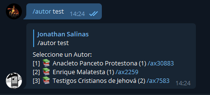

## Calibre Upload Books

This is a bot to be able to search and send your calibre library books through telegram


=================

## Environment:

 Pull or build the docker image and launch it with the following environment variables:

 **TG_AUTHORIZED_USER_ID** : <Your telegram ´chat_id´ authorized> 
 
 **TG_API_ID** : <telegram API key generated at ´Generating Telegram API keys´>

 **TG_API_HASH** : <telegram API hash generated at ´Generating Telegram API keys´>

 **TG_BOT_TOKEN** : <telegram BOT token generated at ´Creating a Telegram Bot´>
 
 **TZ** : America/Santiago

 **TG_CONVERTS_BOOKS** [OPTIONAL]: Enable convert epub to mobi (default: True)>

 **TG_TIMEOUT** [OPTIONAL]: TIMEOUT to convert books in seconds (default: 180 )>
 

## Volumes:

 **/books** : folder Calibre Library
 
 **/output** : folder where the converted files will be saved


Generating Telegram API keys
=================
Before working with Telegram's API, you need to get your own API ID and hash:

1. Go to https://my.telegram.org/ and login with your
   phone number.

2. Click under API Development tools.

3. A *Create new application* window will appear. Fill in your application
   details. There is no need to enter any *URL*, and only the first two
   fields (*App title* and *Short name*) can currently be changed later.

4. Click on *Create application* at the end. Remember that your
   **API hash is secret** and Telegram won't let you revoke it.
   Don't post it anywhere!

Creating a Telegram Bot
=================
1. Open a conversation with [@BotFather](https://telegram.me/botfather) in Telegram

2. Use the /newbot command to create a new bot. The BotFather will ask you for a name and username, then generate an authorization token for your new bot.

   The name of your bot is displayed in contact details and elsewhere.

   The Username is a short name, to be used in mentions and telegram.me links. Usernames are 5-32 characters long and are case insensitive, but may only include Latin characters, numbers, and underscores. Your bot's username must end in ‘bot’, e.g. ‘tetris_bot’ or ‘TetrisBot’.

   The token is a string along the lines of 110201543:AAHdqTcvCH1vGWJxfSeofSAs0K5PALDsaw that is required to authorize the bot and send requests to the Bot API. Keep your token secure and store it safely, it can be used by anyone to control your bot.

docker-compose
=================

```dockerfile
version: '3'

services:

  calibre-upload-bot:
    image: jsavargas/calibre-upload-bot
    container_name: jsavargas/calibre-upload-bot
    restart: unless-stopped
    network_mode: bridge
    environment:
      - 'PUID=1000'
      - 'PGID=1000'
      - 'TG_AUTHORIZED_USER_ID=63460,63466' #<telegram chat_id authorized>
      - 'TG_API_ID=<telegram API key generated at ´Generating Telegram API keys´>'
      - 'TG_API_HASH=<telegram API hash generated at ´Generating Telegram API keys´>' 
      - 'TG_BOT_TOKEN=<telegram BOT token generated at ´Creating a Telegram Bot´>'
      - 'TG_CONVERTS_BOOKS=True'
      - 'TG_TIMEOUT=180'
      - 'TZ=America/Santiago'
    volumes:
      - /path/to/config:/config
      - /path/calibre/library:/books
      - /path//calibre/output:/output
```

## **Changelog:**
**v1.14.7 (03/03/2023/):**
- fix accents in /title (bodoquenet)

**v1.14.6 (28/01/2022/):**
- Update bottorrent.py
- Added TG_TIMEOUT to convert books
- Fixed bugs
- Added more bugs to fix later

**v1.13.15 (28 Oct 2021):**
- Added /countbooks
